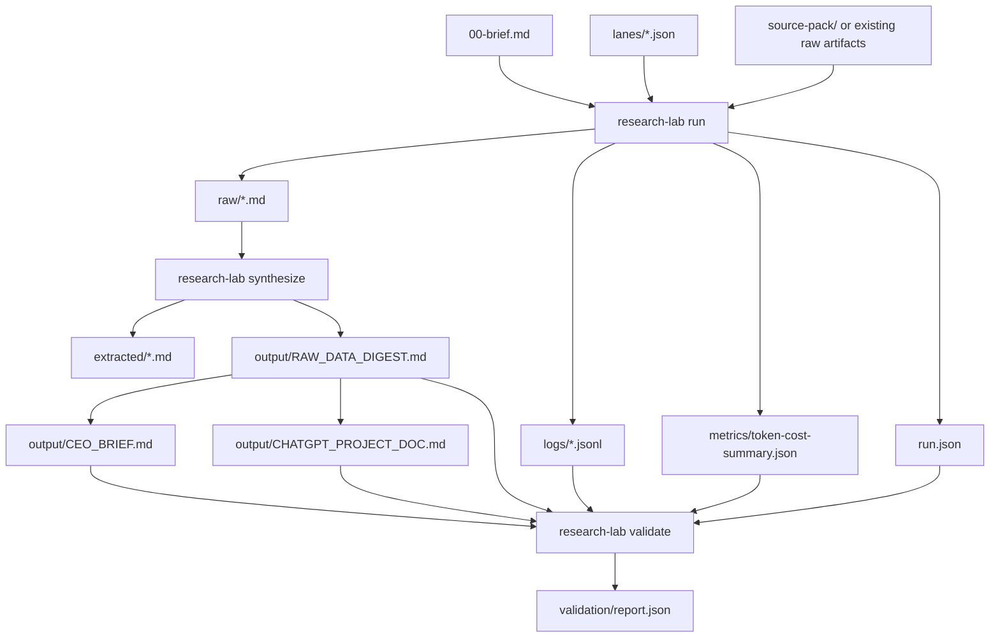

# Research Lab

Research Lab is a minimal filesystem-first research runner. It turns a run folder into lane manifests, raw lane artifacts, JSONL logs, token/cost summaries, deterministic synthesis files, and a validation report.

It is intentionally small. It does not provide autonomous browsing, hidden workers, a web app, a database, or an agent framework. The runtime manages lifecycle and artifacts; humans or explicitly configured local/command executors provide the evidence.

## What It Is

- A TypeScript CLI for structured research runs.
- A run-state format built around `run.json` and `lanes/*.json`.
- Bounded lane execution with `artifact`, `fixture`, and `command` executors.
- JSONL observability for run and lane events.
- Token and estimated-cost accounting, including explicit zero-cost local runs.
- Deterministic parent-only synthesis from raw lane files into the three final artifacts.
- Validation for required files, malformed logs, citation/evidence references, extra final artifacts, token math, and concurrency.

## What It Is Not

- Not LangChain, LangGraph, CrewAI, AutoGen, Temporal, Ray, or a generic agent SDK.
- Not a no-code research platform.
- Not a scraper or browser automation product.
- Not a benchmark harness.
- Not fake telemetry.
- Not a claim that local fixture runs are model-backed research.

## Install

```bash
npm install
npm run typecheck
npm test
npm run preflight
```

During development, run the CLI through npm:

```bash
npm run research-lab -- status examples/apollo-13-oxygen-tank-review
```

After `npm run build`, the package binary is `research-lab`.

## Commands

```bash
research-lab run <run-dir> [--force] [--max-concurrency N]
research-lab synthesize <run-dir> [--force]
research-lab validate <run-dir> [--json]
research-lab status <run-dir> [--json]
```

Development equivalents:

```bash
npm run research-lab -- run examples/apollo-13-oxygen-tank-review --force --max-concurrency 2
npm run research-lab -- synthesize examples/apollo-13-oxygen-tank-review --force
npm run research-lab -- validate examples/apollo-13-oxygen-tank-review
npm run research-lab -- status examples/apollo-13-oxygen-tank-review
```

## Run The Example

```bash
npm run example:run
npm run example:status
```

The checked public example is `examples/apollo-13-oxygen-tank-review/`. It uses a local public-domain NASA source pack and four runtime-managed lanes:

- `timeline-reconciliation`
- `failure-chain`
- `operational-recovery`
- `mission-objective-counterevidence`

The example writes:

- `run.json`
- `lanes/*.json`
- `logs/run.jsonl`
- `logs/*.jsonl`
- `metrics/token-cost-summary.json`
- `raw/*.md`
- `extracted/*.md`
- `output/RAW_DATA_DIGEST.md`
- `output/CEO_BRIEF.md`
- `output/CHATGPT_PROJECT_DOC.md`
- `validation/report.json`
- `screenshots/status.svg`

The current checked example validates with `0` errors and `0` warnings. It is a local fixture run, so estimated provider cost is exactly `$0.000000` and `localOnly` is true.

## Architecture



## Runtime Lifecycle

1. `run` reads `00-brief.md`, creates or refreshes `run.json`, resolves lane manifests, and executes lanes with bounded concurrency.
2. Each lane writes or verifies exactly one `raw/<lane>.md` file.
3. The runtime writes per-lane JSONL logs, run JSONL logs, usage totals, and lane completion state.
4. `synthesize` reads raw lane artifacts and writes extracted notes plus exactly three final outputs.
5. `validate` checks lifecycle coherence, required artifacts, citation/evidence reference closure, logs, token/cost math, output count, and concurrency.
6. `status` prints the current run state without mutating evidence artifacts.

## Lane Executors

Lane manifests live under `lanes/*.json`.

`artifact` lanes validate an existing raw file:

```json
{ "executor": { "type": "artifact" }, "provider": "external", "model": "manual" }
```

`fixture` lanes copy a checked local fixture into `raw/`. They are useful for reproducible public examples and tests:

```json
{
  "executor": {
    "type": "fixture",
    "inputPath": "source-pack/lane-fixtures/timeline-reconciliation.md"
  },
  "provider": "local",
  "model": "fixture"
}
```

`command` lanes run a local command. The runtime sets `RESEARCH_LAB_RUN_DIR`, `RESEARCH_LAB_LANE_ID`, and `RESEARCH_LAB_RAW_PATH`; the command must write the raw lane file.

## Validation Scope

Validation fails on:

- missing `run.json`, lane manifests, raw files, extracted files, final outputs, logs, metrics, or validation report
- malformed JSONL
- final outputs outside the three-artifact contract
- unresolved `S#`, `Q#`, `P#`, `C#`, or `N#` references in final artifacts
- raw `FACT` lines without source IDs
- template placeholders left in artifacts
- negative token/cost values or token math mismatch
- run totals that do not match lane totals
- observed lane concurrency above `maxConcurrency`

Validation is intentionally conservative. It does not prove truth; it proves the artifact contract is coherent enough for a human to inspect.

## Evidence Standard

Research Lab keeps the original evidence discipline:

- raw before synthesis
- cite factual claims with source IDs
- separate fact, inference, and speculation
- preserve contradictions
- preserve negative evidence
- record weak or blocked sources
- keep project/profile docs as context, not external proof
- synthesize only from checked raw lane artifacts

The details live in `docs/RESEARCH_STANDARD.md` and `docs/TOOL_MENU.md`.

Migration notes from the old scaffold live in `docs/MIGRATION.md`.

## Limitations

- No model provider integration is built in yet.
- Cost tracking is estimated from artifacts unless a command executor writes richer metadata later.
- Synthesis is deterministic and deliberately plain; it is not a substitute for expert judgment.
- The validator catches structural and citation-contract failures, not every unsupported natural-language claim.
- Local fixture examples are reproducible, not evidence collection from the live web.

## Public Data Boundary

Generated private runs belong under ignored local folders such as `research/runs/`. Do not commit secrets, private source documents, account exports, raw private datasets, credentials, screenshots from private accounts, or production data.
